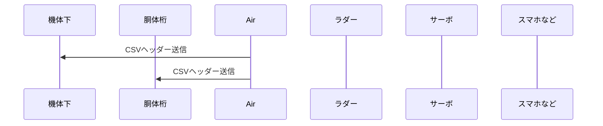
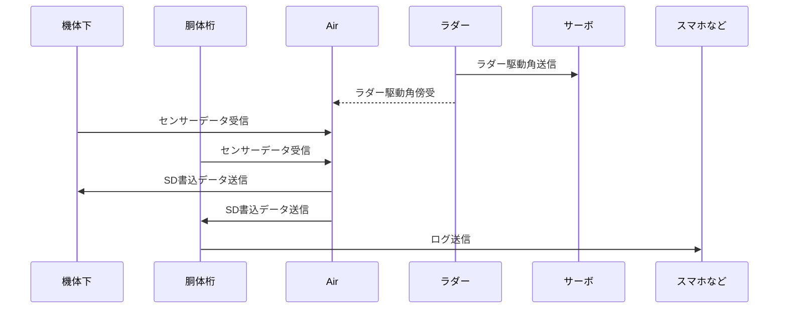
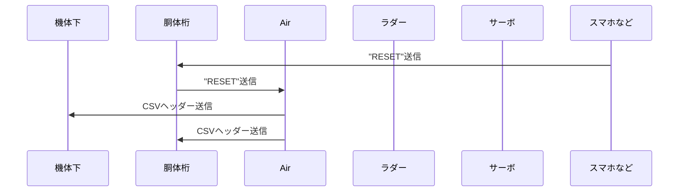
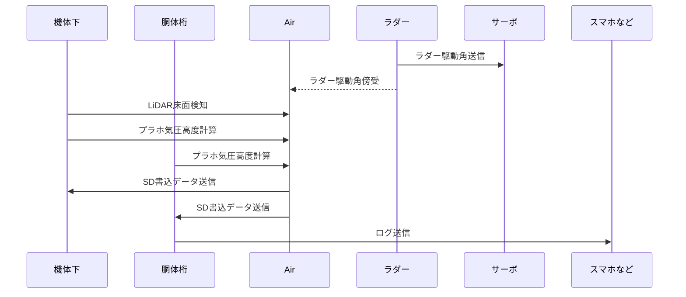
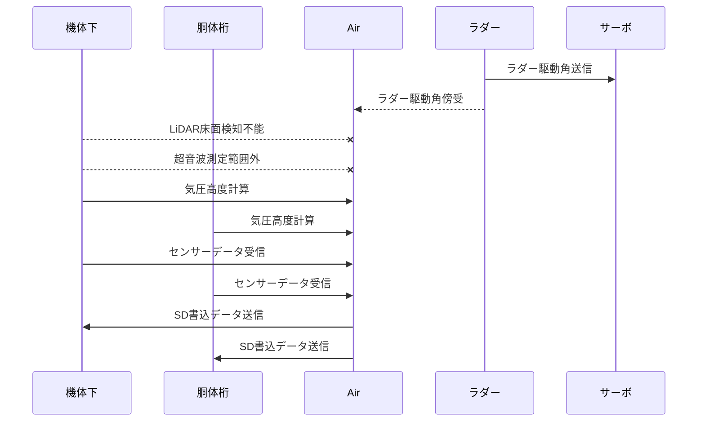
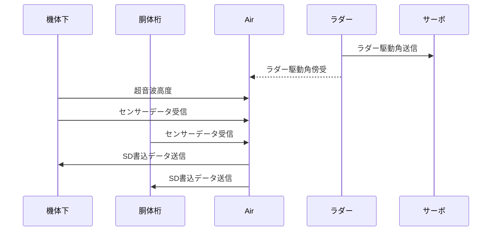

# シーケンス図
## 電源投入時

```mermaid
sequenceDiagram
    participant under as 機体下
    participant fuselage as 胴体桁
    participant air as Air
    participant rudder as ラダー
    participant servo as サーボ
    participant client as スマホなど

    air ->> under: CSVヘッダー送信
    air ->> fuselage: CSVヘッダー送信
```

## 動作中 - 事前動作（キャリブレーション：各センサーの慣らし）

```mermaid
sequenceDiagram
    participant under as 機体下
    participant fuselage as 胴体桁
    participant air as Air
    participant rudder as ラダー
    participant servo as サーボ
    participant client as スマホなど

    rudder ->> servo: ラダー駆動角送信
    rudder -->> air: ラダー駆動角傍受
    under ->> air: センサーデータ受信
    fuselage ->> air: センサーデータ受信
    air ->> under: SD書込データ送信
    air ->> fuselage: SD書込データ送信
    fuselage ->> client: ログ送信
```

## 離陸直前リセット時

```mermaid
sequenceDiagram
    participant under as 機体下
    participant fuselage as 胴体桁
    participant air as Air
    participant rudder as ラダー
    participant servo as サーボ
    participant client as スマホなど

    client ->> fuselage: "RESET"送信
    fuselage ->> air: "RESET"送信
    air ->> under: CSVヘッダー送信
    air ->> fuselage: CSVヘッダー送信
```

## 動作中 - 離陸判定前

```mermaid
sequenceDiagram
    participant under as 機体下
    participant fuselage as 胴体桁
    participant air as Air
    participant rudder as ラダー
    participant servo as サーボ
    participant client as スマホなど

    rudder ->> servo: ラダー駆動角送信
    rudder -->> air: ラダー駆動角傍受
    under ->> air: LiDAR床面検知
    under ->> air: プラホ気圧高度計算
    fuselage ->> air: プラホ気圧高度計算
    air ->> under: SD書込データ送信
    air ->> fuselage: SD書込データ送信
    fuselage ->> client: ログ送信
```

## 動作中 - 離陸判定後（高度8m以上）

```mermaid
sequenceDiagram
    participant under as 機体下
    participant fuselage as 胴体桁
    participant air as Air
    participant rudder as ラダー
    participant servo as サーボ

    rudder ->> servo: ラダー駆動角送信
    rudder -->> air: ラダー駆動角傍受
    under --x air: LiDAR床面検知不能
    under --x air: 超音波測定範囲外
    under ->> air: 気圧高度計算
    fuselage ->> air: 気圧高度計算
    under ->> air: センサーデータ受信
    fuselage ->> air: センサーデータ受信
    air ->> under: SD書込データ送信
    air ->> fuselage: SD書込データ送信
```

## 動作中 - 離陸判定後（高度8m未満）

```mermaid
sequenceDiagram
    participant under as 機体下
    participant fuselage as 胴体桁
    participant air as Air
    participant rudder as ラダー
    participant servo as サーボ

    rudder ->> servo: ラダー駆動角送信
    rudder -->> air: ラダー駆動角傍受
    under ->> air: 超音波高度
    under ->> air: センサーデータ受信
    fuselage ->> air: センサーデータ受信
    air ->> under: SD書込データ送信
    air ->> fuselage: SD書込データ送信
```