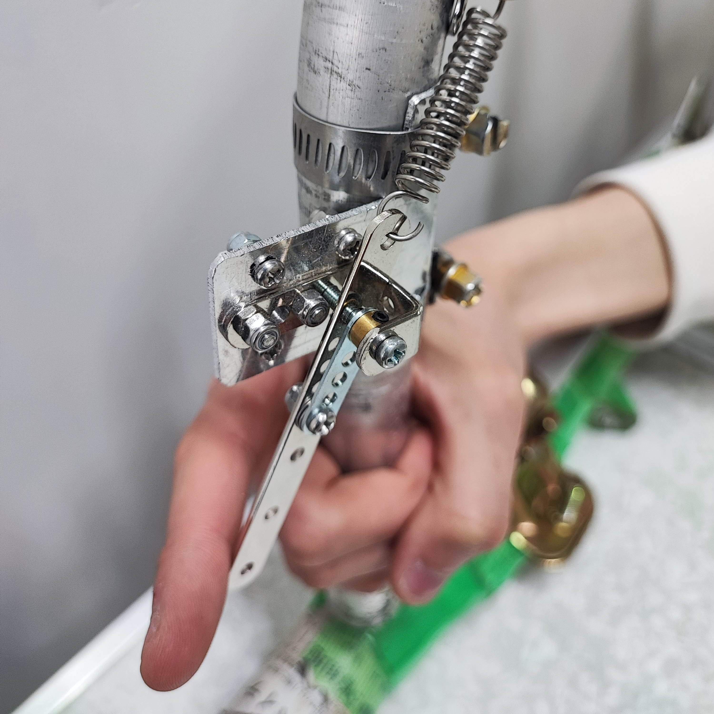
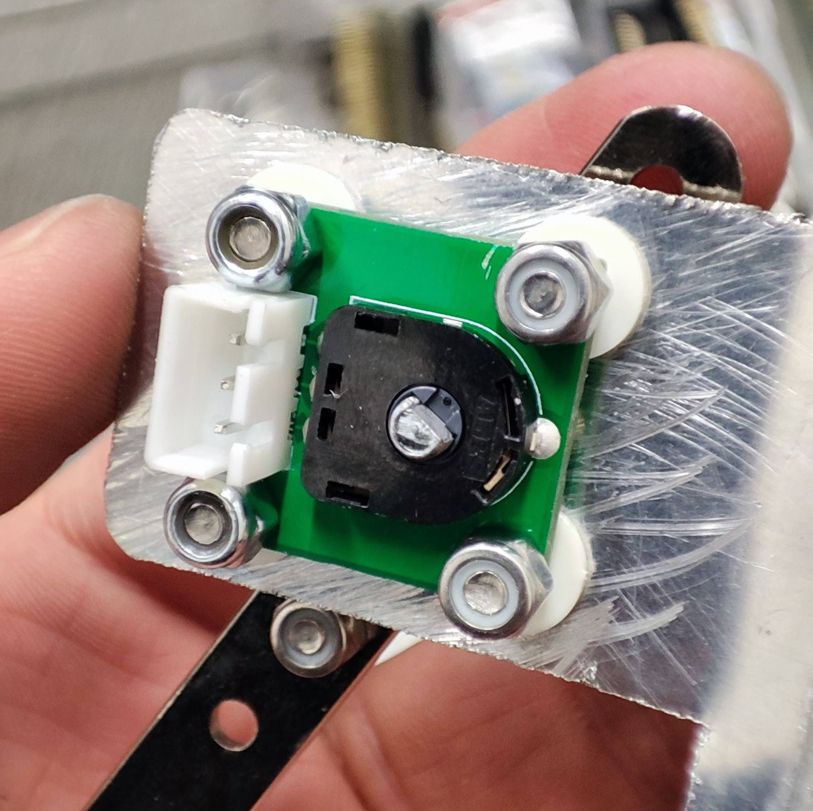

# ラダーレバー

## 前提
- 対象の機体はエレベータを持たず，パイロットの体重移動によってピッチをコントロールする．
- ラダーの駆動はサーボモータによる「フライ・バイ・ワイヤ」システムである．

## 要求
1. 信頼性の高いシステムとすること．
2. パイロットが体重移動とラダー操作を同時に実施できるようにすること．
3. 確かな操舵反力（およそ1~2kg）が得られること．
4. 単体でサーボモータを制御できること（全機能喪失時のフェイルセーフ）．

## 要件
- [要求1]より，これまでの実績から，サーボモーターは[KRS-4034HV ICS](https://kondo-robot.com/product/krs-4034hv-ics)を使用する．
  - ラダーを駆動するのに十分とみられるトルク（41.7kgf・cm）が得られる．
  - サーマルシャットダウン（温度リミッター）の設定値を変更することで，最大約120℃まで動作させられる．
- [要求2]より，左右独立のレバー式とし，フレームを握る手を離さずとも操作可能にする．
- [要求3]より，強い復元力は引きバネにより得る（引っ掛ける場所さえあれば良いため）．
  - センサーによりレバーの角度を取得するか，何らかの方法で「操舵力」を直接取得する．
- [要求4]より，コストの問題から，マイコンを右レバーにのみ搭載し，サーボモータの制御信号を生成する．
  - 左レバーはマイコンを用いず，およそ1700mmのケーブルを経て右レバーに接続する．

## 要件分析
### 角度センサーについて
- 抵抗式ポテンショメータには回転トルクが少なく非常に好ましいものがある（例. RDC50シリーズ：25代機 竜海のラダーレバーで採用）が，[要求3]より軸におよそ1~2kgの荷重がかかるため，それがセンサーに負荷すると物理的破損や角度読み取り誤差増大につながる恐れがあった．
  |||
  |:--:|:--:|
  |
25代機 竜海のラダーレバー
|<a align="center" href="https://tech.alpsalpine.com/j/products/detail/RDC501051A/">アルプスアルパイン製 RDC501051A</a>|
- 磁気式エンコーダ（AS5600など）は非接触かつ高分解能（0.09deg刻み）で回転量を読み取れるが，高コストである．
- 以上のような角度センサーを用いる場合，以下のような懸念点がある．
  - 角度の初期値，回転方向について十分注意しなければならない．
  - 滑らかに回転させて正しく角度を検出するためには，高い製作精度が必要になる．

### ロードセルについて
- レバー自体をロードセルとして，操舵力を直接測定する方式を考案．
- 以下のような利点がある．
  - 角度の初期値，回転方向を考慮する必要がなくなる．
  - 荷重によりセンサーが破損する可能性がほぼなくなる．
  - レバーの可動軸上にセンサーを配置する必要がなくなり，設計の自由度が上がる．

### ロードセルの選定
- 秋月にあるビーム（片持ち梁）型から選ぶ．
- 2kg，5kg，10kgが候補になるが，ロードセル自体の重量を抑えるべく，2kgを選定した．
  - 電装はピッチ方向の慣性モーメントについて，多少の憂慮をしなければならない．
- ロードセルの出力電圧は1mV/V（すなわち3.3V印加+最大負荷時は3.3mV出力される）．

### 構成
- ロードセルの出力を増幅する方法は以下のとおりであり，2.を採用した．
  1. HX711 24bitADCを利用する（定石，しかし頑張っても80Hzまでしかデータレートが出ない）．
  2. 計装アンプを使って増幅し，マイコンのADCで読み取る（RP Picoなら理論上，最大50万Hzのデータレート）．
- 
