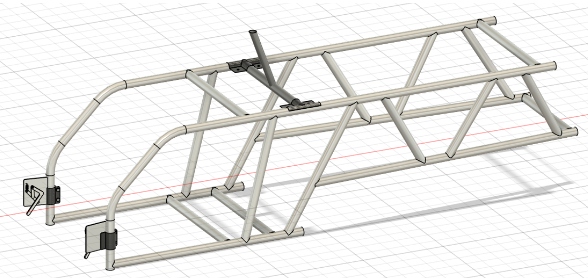

# エアデータ電装部について

## 26代の設計・理由
「できるだけカウルに影響を与えない」をモットーにしていた．  
カウルに開ける穴を最小限にしつつカウル外部に固定するのに，これ以外の方法が思いつかなかった．
- 70degに接合した水平PC（ポリカーボネート）パイプとCF（カーボン繊維）パイプに電装を組み付ける．
- ベース・下パイプはフレームにカーボンの固定具で固定する．
- カウル内に接触しない長さの下パイプがあり，カウルにあいた穴から差し込む．
- カウル内部でネジ止めする．

|||
|:--:|:--:|
|ベース・下パイプ|水平・上パイプ|

## 26代の設計の問題点
- 電源投入時と取付時は，コクピ内で作業しなければならない．
  - 今回は許してもらっていたが，なによりコクピ班に迷惑．
  - ハッチがあるならなおさら迷惑だし，辞めたほうがいい．

## 26代を踏まえた改善点
- カウルへの影響の最小化を諦め，開口部を大きくしてもらう（電装ハッチをつけてもらう）．
- ピトー管搭載位置を再検討する（でもAoA,AoSはコクピ上じゃないと厳しいかも）．