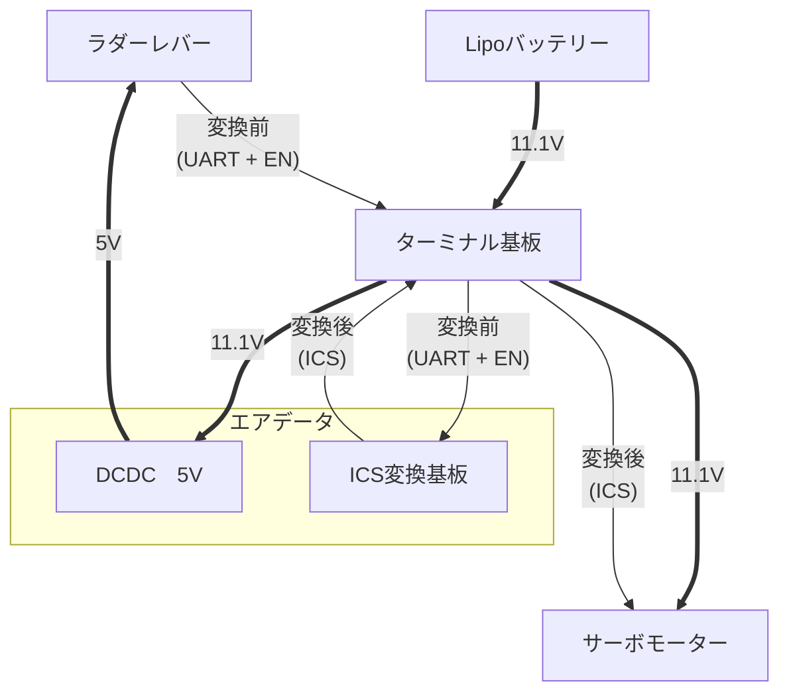

# ラダーシステムについて

## 鳥コン当日，プラホ上で発生した事象
- プラットフォーム上，バッテリー交換により電圧が上昇した状態での電源投入直後，トライステートバッファの異常発熱による発煙，それに伴うICS通信機能全喪失

## 原因
現状では再現できておらず，未確定
- 過熱環境，通信の衝突などを再現したものの，事象の再現には至らなかった．

以下の要因による素子の劣化が最も疑わしい．
- ICS通信として想定されている以上の長さ（4m程度）に延長して通信をおこなったこと
- 電源が入ったままサーボのコネクタを抜き差ししたこと
  - 近藤化学のサポートに連絡したところ，異常発熱との直接的な関連は判断しかねるが，1.5m程度までを推奨しているとのこと．
  - 通信距離が長くなるほど信号のなまりが発生し，正常な通信が行えなくなる可能性があるとのこと．

## 公式のICS変換基板に関して
- 定価1980円（2026/08/26現在）であり，決して安くない．
- 原因不明の故障を起こしやすく，利用価値が低い．

### 入手した故障報告
- 早稲田大学のWASA鳥人間Projectでは，レギュレーターの故障で5枚のICS変換基板が使用不可に．
- 芝浦工業大学のTeam Birdman Trialでは，レギュレーターの故障で3枚のICS変換基板が使用不可に．

## 今年のICS変換基板
- 「壊れやすくて高価」なICS変換基板 → 「高価」の解決のためにICS変換基板を自作
  - 「壊れやすくて」には寄与する意図はなく，慎重に様子を見ながらの運用だった．
  - この際にレギュレーターを廃したため，実質的には寄与があったかもしれない．
- 回路図は近藤化学のICSコマンドリファレンスなどに公開されている．

## 今年のラダー周りの構成

## 許容していた問題点
- ターミナル基板とエアデータをつなぐ11線の通信のエラーが致命的になること．
  - ケーブルの予備，ケーブル修理キットを用意することで最速修理可能な状態にした．
- ターミナル基板のエラーが致命的になること．
  - 基板自体にエラーが発生する確率が限りなく低いと評価（ただの配線のみで素子を搭載していないため）．
  - 基板自体の予備を用意した．
- エアデータ電装部の基板が無いとラダーが駆動できないこと．
  - バッテリーが1つで共通である以上，避けられないと判断．
  - これまでの実績から，前日までの準備次第で問題を最小化できると判断．

# 事後情報
トライステートバッファーによる半二重通信は，信号の衝突が起こると短絡状態になり抵抗ゼロで大電流が流れる場合がある
図のYがHIGHのとき，nMOSがONになるとGNDへ直結，短絡回路が形成される

||
|:--:|
|
内部回路の例
|

しかし実際に再現しても，異常発熱には至らなかった（3~5分程度衝突させた）．

## 今年を踏まえた改善点
- 基板の細分化
  - ラダー関連の部品がエアデータ電装部の基板に一体化してしまっていた．
  - ラダー関連の基板だけでの運用ができるようにすべき．