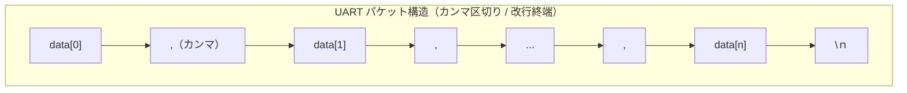
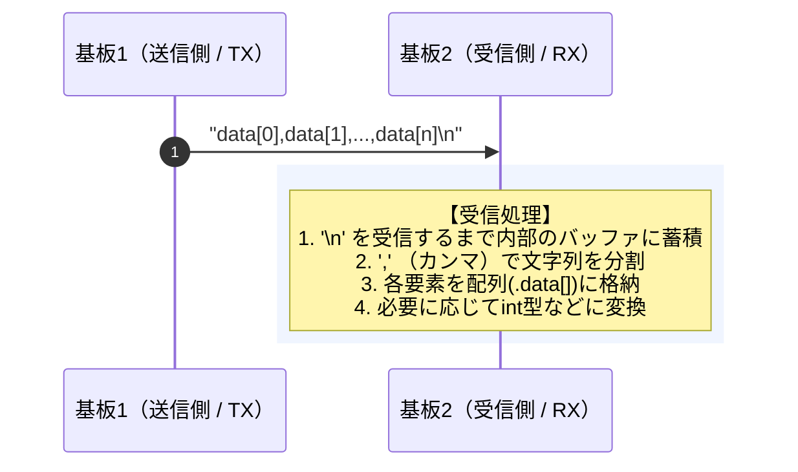

# 基板間のUART通信について
## 通信の基本
基板間のUART通信の基本的なフォーマットについて述べる．

### パケット構造
- 各データをカンマで区切り，終端に'\n' を付加して送信する．


### 送受信シーケンス（基板間の通信と処理の流れ）
- 送信後，`TORICA_UART.h/.cpp`が受信したデータを分解し，それぞれ配列に格納する．



# 実際のコード
`UARTHelper_Bico.h/.cpp`にUART通信の本体部分が，`26th_Air_Bico.ino`に通信を実際に実行するコードが書かれている．

[L281-L284](https://github.com/torica-org/2026-fm-archives/blob/main/Software/AirData/26th_Air_Bico/26th_Air_Bico.ino#L281-L284)

`receiveUnderLog()`関数内について．
```c:UARTHelper_Bico.cpp
// 機体下受信
static unsigned long int last_under_time_ms = 0;
int readnum_under = Under_UART.readUART();
const int under_data_num = 5;  // 正常な場合のデータ受信数
```
- `last_under_time_ms`: 最後に機体下電装からデータを受信した時間を格納する変数．
- `readnum_under`: 機体下基板から受信したデータの個数．`.readUART()`はUARTでデータを受信し，カンマで区切られたデータの個数を返り値として返す．例えば，"1,2,3,4\n"という文字列を受信したら，`4`を返す．
- `under_data_num`は正常に通信できた場合の受信データの個数．この値は書き換えてはならないため，定数をあらわす`const`をつけておく．


[L286-L294](https://github.com/torica-org/2026-fm-archives/blob/main/Software/AirData/26th_Air_Bico/26th_Air_Bico.ino#L286-L294)

```c:UARTHelper_Bico.cpp/.h
if (readnum_under == under_data_num) {
    last_under_time_ms = millis();
    // 受信データを格納
    data_under_bmp_pressure_hPa = Under_UART.UART_data[0];
    data_under_bmp_temperature_deg = Under_UART.UART_data[1];
    data_under_bmp_altitude_m = Under_UART.UART_data[2];
    data_under_urm_altitude_m = Under_UART.UART_data[3];
    data_under_tsd20_altitude_m = Under_UART.UART_data[4];
}
```
- if文内の処理は，機体下電装から受信したデータの個数が正常だった場合のみ行われる．


## Bico-Under

## Bico-Rudder

## Bico-Fuselage

## Bico-XIAO間