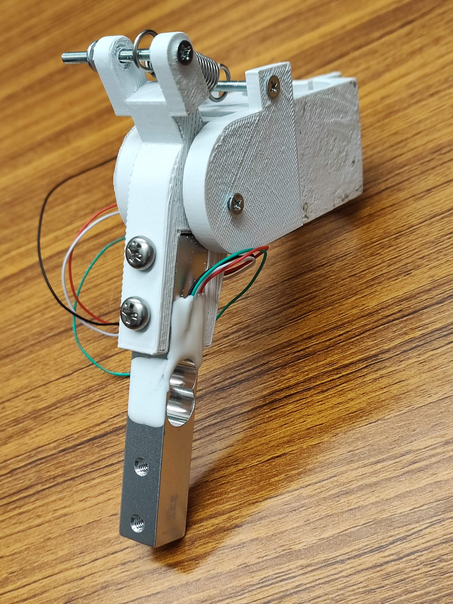
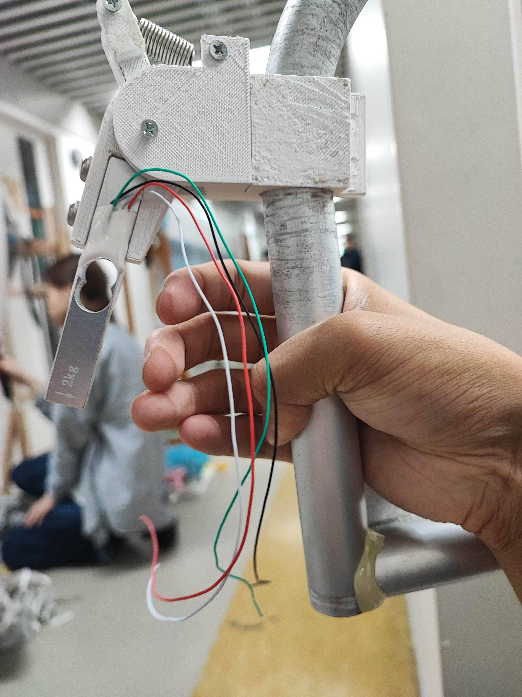
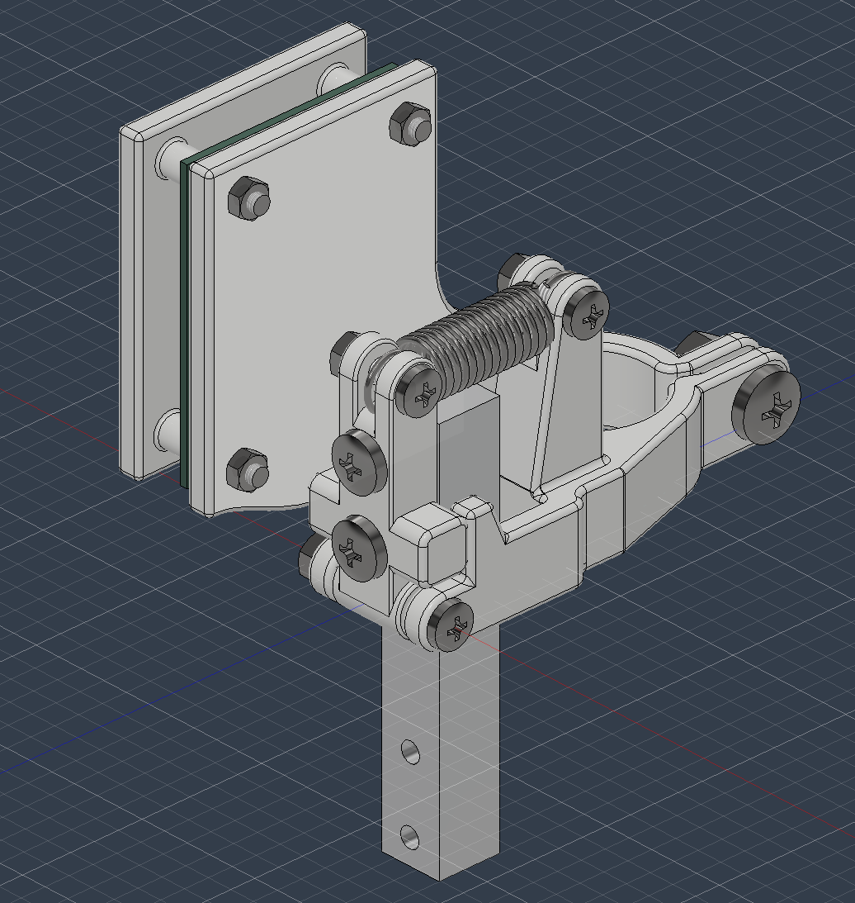
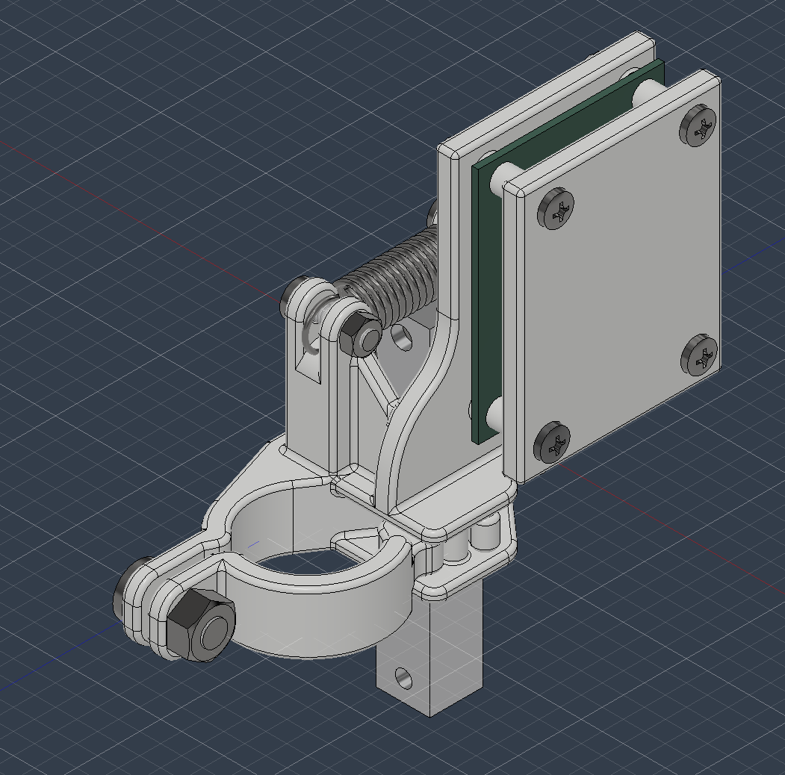
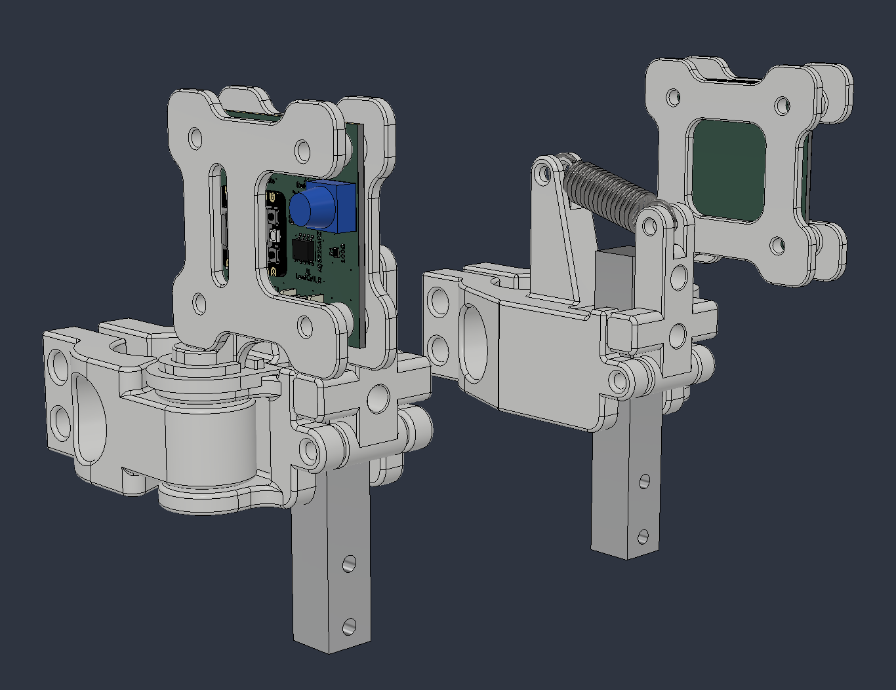
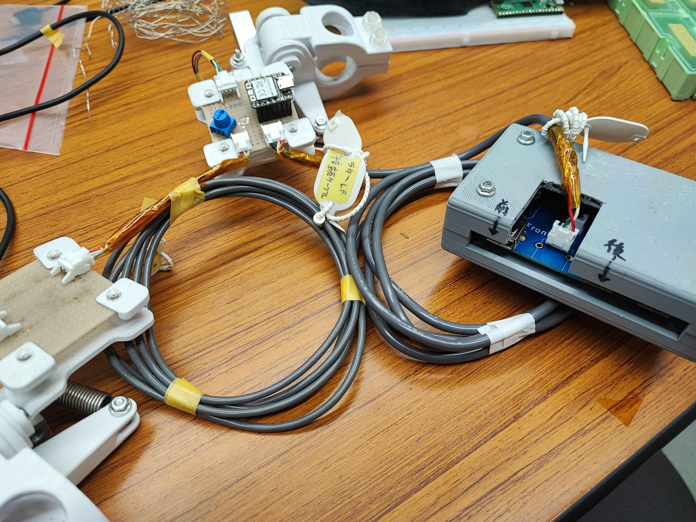
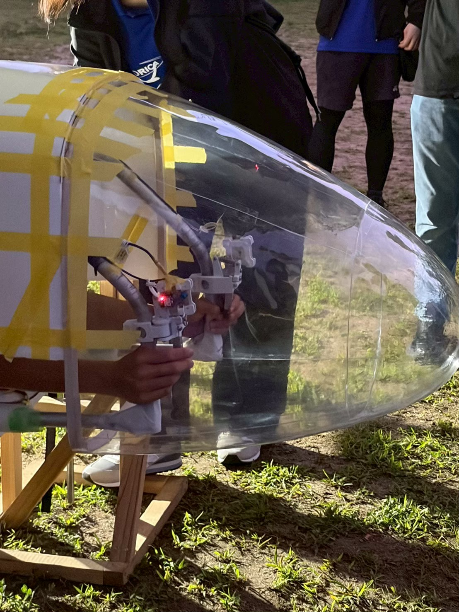
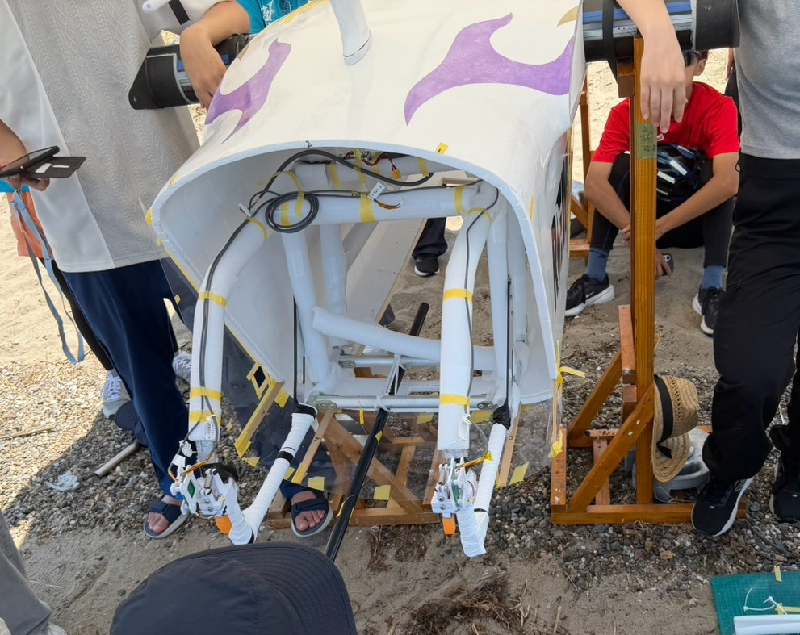
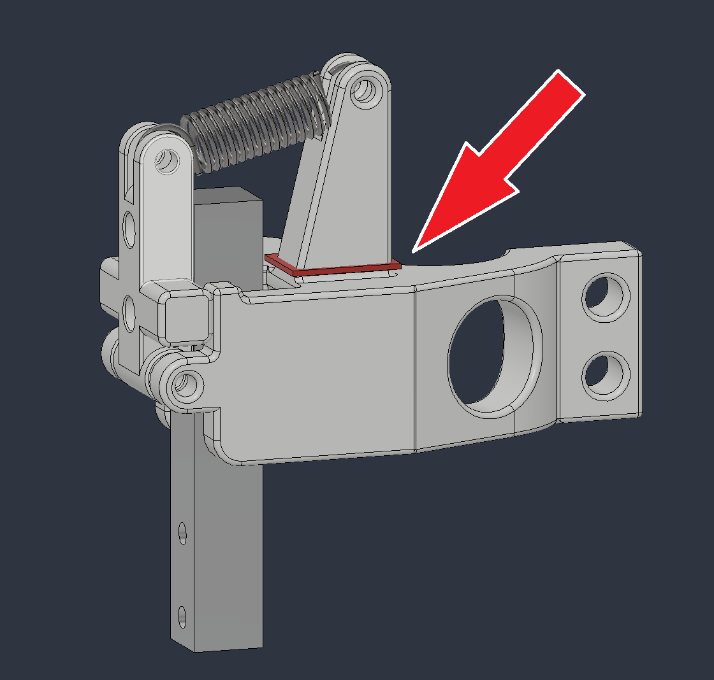

# ラダーレバー

## 前提
- 対象の機体はエレベータを持たず，パイロットの体重移動によってピッチをコントロールする．
- ラダーの駆動はサーボモータによる「フライ・バイ・ワイヤ」システムである．

## 要求
1. 信頼性の高いシステムとすること．
2. パイロットが体重移動とラダー操作を同時に実施できるようにすること．
3. 確かな操舵反力（およそ1~2kg）が得られること．
4. 単体でトリム調整を含むサーボモータの制御ができること（全機能喪失時のフェイルセーフ）．
5. 簡単に取り付けられること（25代機 竜海のホースバンド固定はやりにくかった）．

## 要件
- [要求1]より，これまでの実績から，サーボモーターは[KRS-4034HV ICS](https://kondo-robot.com/product/krs-4034hv-ics)を使用する．
  - ラダーを駆動するのに十分とみられるトルク（41.7kgf・cm）が得られる．
  - サーマルシャットダウン（温度リミッター）の設定値を変更することで，最大約120℃まで動作させられる．
- [要求2]より，左右独立のレバー式とし，フレームを握る手を離さずとも操作可能にする．
- [要求3]より，強い復元力は引きバネにより得る（引っ掛ける場所さえあれば良いため）．
  - センサーによりレバーの角度を取得するか，何らかの方法で「操舵力」を直接取得する．
- [要求4]より，マイコンを右レバーに搭載し，サーボモータの制御信号を生成する．
  - トリム調整用可変抵抗器も搭載する．
  - 左レバーはマイコンを用いず，およそ1700mmのケーブルを経て右レバーに接続する．
- [要求5]より，クランプをもつ構造で，ボルト・ナット数本で固定できるようにする．

## 要件分析
### 角度センサーについて
- 抵抗式ポテンショメータには回転トルクが少なく非常に好ましいものがある（例. RDC50シリーズ：25代機 竜海のラダーレバーで採用）が，[要求3]より軸におよそ1~2kgの荷重がかかるため，それがセンサーに負荷すると物理的破損や角度読み取り誤差増大につながる恐れがあった．

|||
|:--:|:--:|
|25代機 竜海のラダーレバー|[アルプスアルパイン製 RDC501051A](https://tech.alpsalpine.com/j/products/detail/RDC501051A/)|

- 磁気式エンコーダ（AS5600など）は非接触かつ高分解能（0.09deg刻み）で回転量を読み取れるが，高コストである．
- 以上のような角度センサーを用いる場合，以下のような懸念点がある．
  - 角度の初期値，回転方向について十分注意しなければならない．
  - レバーの可動軸と同軸上にセンサーを配置しなければならず，設計の自由度が下がる．
  - 滑らかに回転させて正しく角度を検出するためには，高い製作精度が必要になる．

### ロードセルについて
- レバー自体をロードセルとして，操舵力を直接測定する方式を考案（3/10）．
- 以下のような利点がある．
  - 角度の初期値，回転方向を考慮する必要がなくなる．
  - 荷重によりセンサーが破損する可能性がほぼなくなる．
  - レバーの可動軸上にセンサーを配置する必要がなくなり，設計の自由度が上がる．

### ロードセルの選定
- 秋月にあるビーム（片持ち梁）型から選ぶ．
- 2kg，5kg，10kgが候補になるが，ロードセル自体の重量を抑えるべく，2kgを選定した．
  - 電装はピッチ方向の慣性モーメントについて，多少の憂慮をしなければならない．
- ロードセルの出力電圧は1mV/V（すなわち3.3V印加+最大負荷時は3.3mV出力される）．

### 構成
- ロードセルの出力を増幅する方法は以下のとおりであり，2.を採用した．
  1. HX711 24bitADCを利用する（定石，しかし頑張っても80Hzまでしかデータレートが出ない）．
  2. 計装アンプを使って増幅し，マイコンのADCで読み取る（RP Picoなら理論上，最大50万Hzのデータレート）．
- ノイズの影響を抑えるため，計装アンプは左右どちらにも搭載し，増幅してから長いケーブルを伝わるようにした．
- 左ロードセル -> 左基板上計装アンプ -> ケーブル -> 右基板上マイコン
- 右ロードセル -> 右基板上計装アンプ -> 右基板上マイコン
- ケーブルのコネクタは全電装で共通化するため，すでに使用していたPAコネクタを使用した．

## 開発・試験
### PM：プロトタイプモデル（完成：5/20）
「とりあえず作ってみる」ができるのが3Dプリント品の良さである．
27代のK.K.さんにお願いして試作品を作ってもらった．

|||
|:--:|:--:|
|ラダーレバー(PM)|レバーの距離が遠い|

PMで，以下の情報が得られた．
- バネを固定するネジの中心間距離は35mmが適切
- パイロット宮藤の指が楽に届くようにするには，フレームパイプから20mmぐらいの位置が適切
- 固定するためのクランプの根本は，単純な突起だけだと嵌め込むのが困難

### EM：エンジニアリングモデル（モデリング完了：6/15）
PMで得られた情報を基に，検討しながら一気に設計した．
ここで，ロードセル固定具を非常にシンプルな形状に変更した．
ロードセルを内側に配置することで，バネが伸びることのできる距離を稼ぎつつ，レバーとフレームパイプの距離を短縮することができた．

|||
|:--:|:--:|
|ラダーレバー(EM)前方|ラダーレバー(EM)後方|

### FM：フライトモデル（野田TF2日目にて初動作：7/5）
ここまで，ロードセル出力の増幅に汎用オペアンプを使用する予定だったが，増幅倍率と精度が十分でないことが判明した．
計装アンプを使用するように変更，基板を設計し直して発注した．  
（延期された野田TFには基板が間に合わなかったためにユニバーサル基板で基板を製作した．）  
3Dモデルも基板の変更に合わせて再設計し，EMで得られた修正点を適用した．
3D，PCB，SoftwareのFMは[2026-fm-archives/ラダーレバー](https://github.com/torica-org/2026-fm-archives/ラダーレバー)にある．
ロードセルとアンプに関する[詳しい資料](https://github.com/torica-org/electronics-docs/tree/main/各部品ごとの資料/ロードセルとアンプ.md)は別に示す．

||
|:--:|
|ラダーレバー(FM)|

## 配備
### シミュレーター（配備完了：7/8）
シミュレーター用シリアル通信制御基板を改造して，FMのラダーレバーをそのまま接続できるようにした．

||
|:--:|
|シリアル通信制御基板に接続したラダーレバー|

### 実機
#### 野田TF（2日目：7/5）
- 野田TF2日目にてユニバーサル基板で初動作，問題なし．

||
|:--:|
|野田TFにて初回動作試験|

#### 第4回全組（7/11）
- 第4回全組での初回試行でサーボモーターが動作せず．
  - まず，プログラムを疑った（ユニバーサル基板ではなくプリント基板であり，ピン指定が異なった）．
  - 20分程度の点検の末，Air - ラダー接続ケーブルのPAコネクターの圧着不良で抜けがあることを確認．
  - しかし，交換しても動作せず．
  - プラホ練前にAir - サーボ接続ケーブルのPAコネクターの圧着不良で抜けがあることを確認．
  - 15分程度の電装待ちの末，プラホ練で無事動作成功．
  - 班長会議では以下のことを議論した．
    - 電装の交換にはかなり時間がかかったが，これは予備が用意できなかったためで，本番ではより早く交換が可能．
    - コクピ班はケーブルへの接触が多いため，気をつけてもらうこと．
    - 電装もデバッグではまずケーブルを疑い，すぐ交換できる用意をしておくこと．

#### 出発前（7/24）
- オレンジ色のテニスグリップをレバー先端に巻き付け，滑り防止とした．

#### 本番前日（7/25）
- 養生を次期電装班長にお願いしてやってもらった．
  - 今年は審査が緩かったような気がする．去年は金属の露出1箇所で注意された．
  - 本来は，金属の露出が一切ない状態まで持っていくべき．
- 夜間保持中，左ラダーレバーにアイスクリームがかかり，動作確認のため電装班員1名が出動．
  - 問題なく動作

||
|:--:|
|本番前日キャノピー取り付け前|

#### 本番当日（7/26）
- プラホ上でICS変換基板からの発煙があったが，ラダーレバー自体は問題なく動作していた．

### 事後検証
- 8/15のHPA飛行会にて，展示中にバネ保持部の根本を折損した．
  - 積層の向きにそって折れ，根本を太くするだけでは不十分であることがわかった．
  - 大型になると積層の向きを考慮できなくなるため，パーツ分割数を増やすべきである．

||
|:--:|
|折損箇所|

