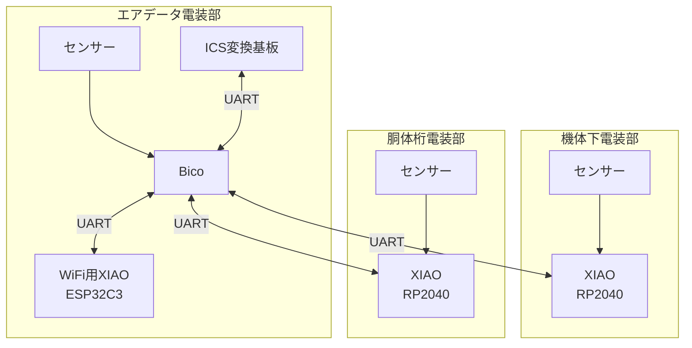

# 通信の構成

## 基板間の通信プロトコル
UARTを使用した．  
通信は8bit，偶数パリティ（`SERIAL_8E1`）の設定であった．

エアデータ電装部のBicoから見た通信を以下に示す．  
（Bicoが全てのログを収集し，計算と文字列生成をおこなっている．）

|相手|役割|速度|受信内容|送信内容|
|:--:|:--:|:--:|:--:|:--:|
|ICS変換基板|通信の変換|115200bps|サーボ駆動角|サーボ駆動角|
|WiFi用XIAO(ESP32C3)|WiFI，SD記録|460800bps|WiFi経由コマンド|全てのログ|
|機体下電装部|センサー|460800bps|超音波,LiDARなど|全てのログ|
|胴体桁電装部|センサー，Bluetooth|460800bps|姿勢角など|全てのログ|

## 構成

