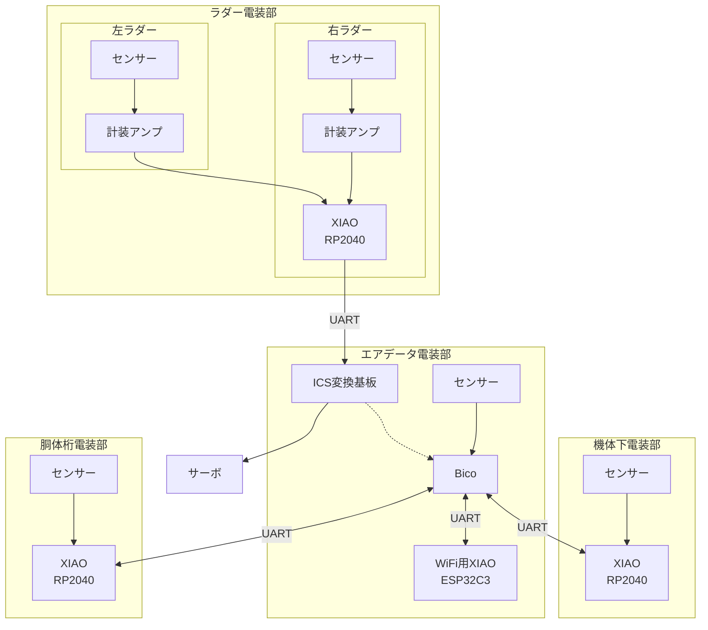

# 通信の構成

## 基板間の通信プロトコル
UARTを使用した．  
通信は8bit，偶数パリティ（`SERIAL_8E1`）の設定であった．

エアデータ電装部のBicoから見た通信を以下に示す．  
（Bicoが全てのログを収集し，計算と文字列生成をおこなっている．）

|相手|役割|速度|受信内容|送信内容|
|:--:|:--:|:--:|:--:|:--:|
|ICS変換基板|通信の変換|115200bps|サーボ駆動角|サーボ駆動角|
|WiFi用XIAO(ESP32C3)|WiFI，SD記録|460800bps|WiFi経由コマンド|全てのログ|
|機体下電装部|センサー|460800bps|超音波,LiDARなど|全てのログ|
|胴体桁電装部|センサー，Bluetooth|460800bps|姿勢角など|全てのログ|

## 構成


## とても大まかな通信の仕組み
1. 電源投入と同時に各基板のマイコンの`setup()`が走る
  - センサーや通信の初期化・開始処理
2. 各電装部はUARTを送信，メインからのUARTが届くのを確認し続ける
3. メインは各電装部からのUARTをTORICA_UARTでパース（分解）して処理，CSVファイルとして保存できるようにカンマ区切りの文字列をログとして生成してSDカードに保存

例として，
```cpp
TORICA_UART my_UART(&Serial1);
```
としてインスタンス化したとする．

3個のデータを処理するなら，
```cpp
int readNum = my_UART.readUART(); // 受信データ数が返る
if (readNum == 3) { // 受信データ数確認
    data0 = my_UART.UART_data[0];
    data1 = my_UART.UART_data[1];
    data2 = my_UART.UART_data[2];
}
// 何も処理せずそのままロギングするなら
char trans_buff[128];
sprintf(trans_buff, "0.2f,0.2f,0.2f", data0, data1, data2); // trans_buffにカンマ区切りの文字列（ログ）が格納される
```

4. メインは各基板のUARTにログを送信、各電装部は受信した文字列をSDカードに保存
5. 以上を繰り返す