# KiCadで設計した基板をJLCPCBに発注する方法　～基板完成後から発注まで～

本記事ではKiCadで設計した基板をJLCPCBに発注する方法を解説します．

前提条件：KiCadをインストールしている＆完成した基板データを持っている

## １．前準備（プラグインインストール．初回のみ）
KiCadにJLCPCB発注用のプラグインをインストールします．KiCadを起動し，上のツールバーから"Tools" -> "Plugin and Content Manager"の順にクリックします（図１）．

  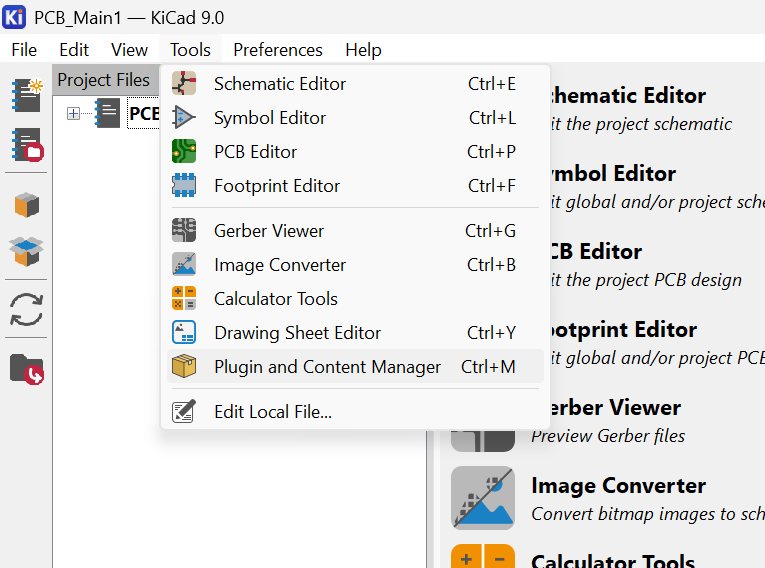

<!---->

  図1　Plugin and Content Managerの起動

 

"Plugin and Content Manager"が起動するので検索窓に「jlc」と入力（図２）．

  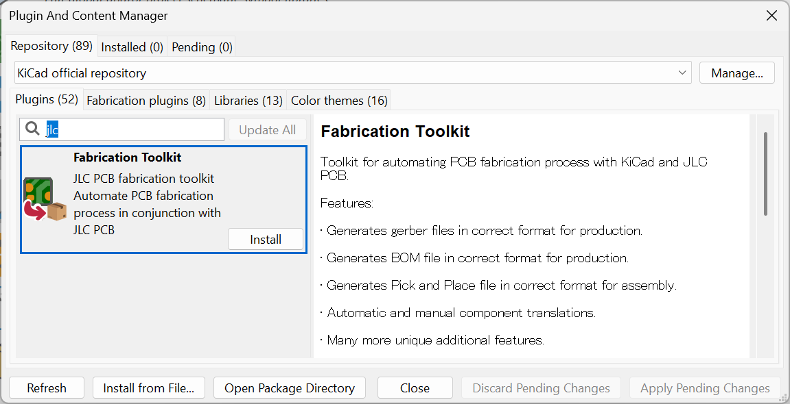

  図2　Fabrication Toolkitのインストール（１）

 

入力したら「Fabrication Toolkit」というプラグインが出てくるので"Install"をクリックします．クリックしたらウィンドウの右下"Apply Pending Changes"をクリックして変更を適用します．

  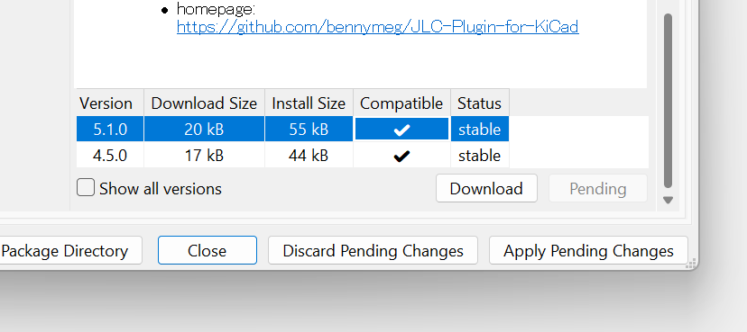

  図3　Fabrication Toolkitのインストール（２）

 

これで"Fabrication Toolkit"のインストールが完了しました．

## ２．発注用ファイル（ガーバーデータ）の作成
ここでは完成した基板データを発注用ファイル（ガーバーデータ）に変換する方法を扱います．例としてMain 1層目の基板データを使います．

まず完成した基板データ（ここでは"PCB_Main1.kicad_pcb"）をKiCadで開きます（図4）．

  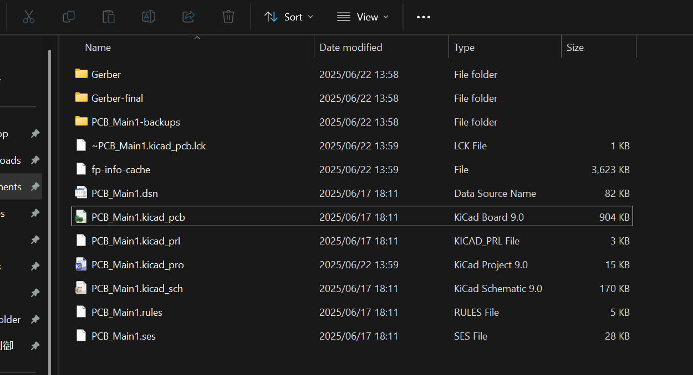

  図4　基板データ内のフォルダ構造

 

次にKiCadのツールバーの一番右にある"Fabrication Toolkit"をクリックします（図5）．

  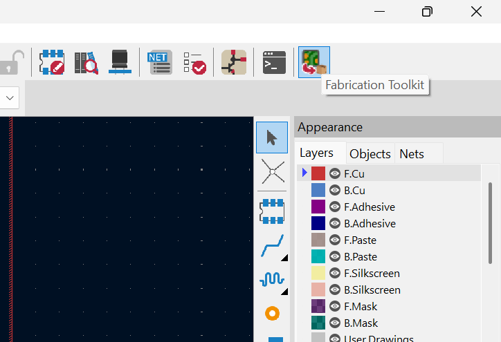

  図5　Fabrication Toolkitの起動

 

起動したら図6のような画面が起動します．

  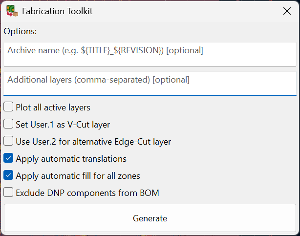

  図6　Fabrication Toolkitによるガーバーデータの生成（１）

 

起動したら"Generate"をクリック．いろいろなオプションがありますが，基本的には初期設定のままで大丈夫です．クリックしたら基板データを保存しているフォルダ内に"production"というフォルダーが生成され，その中にガーバーデータ（ここでは"PCB_Main1.zip"）が保存されます（図7）．これでガーバーデータの出力が完了しました．

  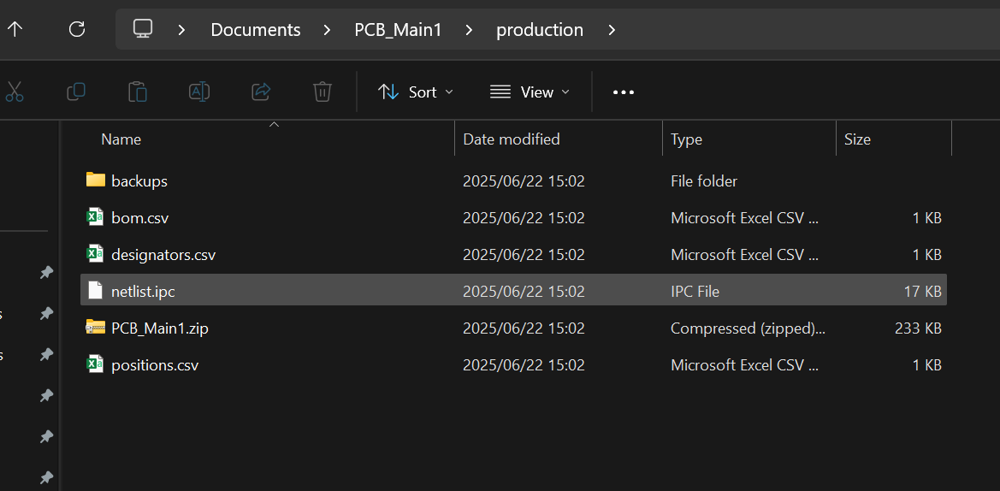

  図7　Fabrication Toolkitによるガーバーデータの生成（２）

 

## ３．JLCPCBに発注
ガーバーデータが完成したら次はいよいよ発注です．[ここ](https://jlcpcb.com/jp/)をクリックしてJLCPCBにアクセスしてください．アクセスし，ログインすると右上の「発注する」というボタンをクリックします（図8）．

  

  図8　ガーバーデータのアップロード（１）

 

クリックしたら「ガーバーファイルを追加」をクリックし，２．発注用ファイル（ガーバーデータ）の作成　で生成したガーバーデータ（ここではPCB_Main1.zip）を選択し，アップロードします（図9）．

  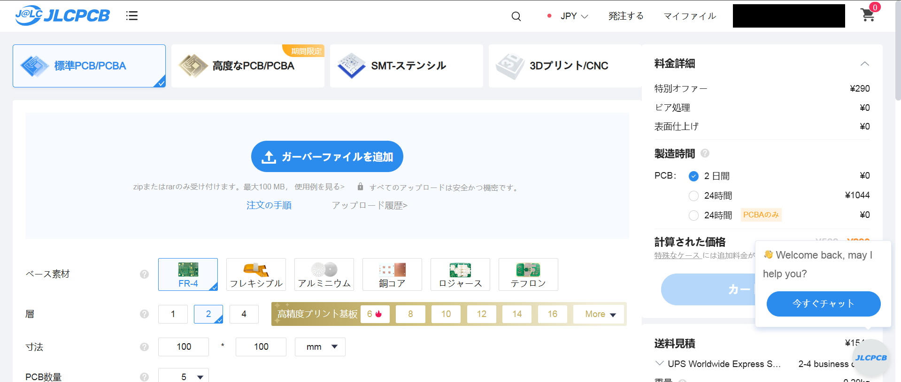

  図9　ガーバーデータのアップロード（２）

 

アップロードし，「ガーバービューアー」をクリックすると図10のように作成した基板の2D/3Dイメージが出ますので，設計通り出力されているか確認してください（図10）．

  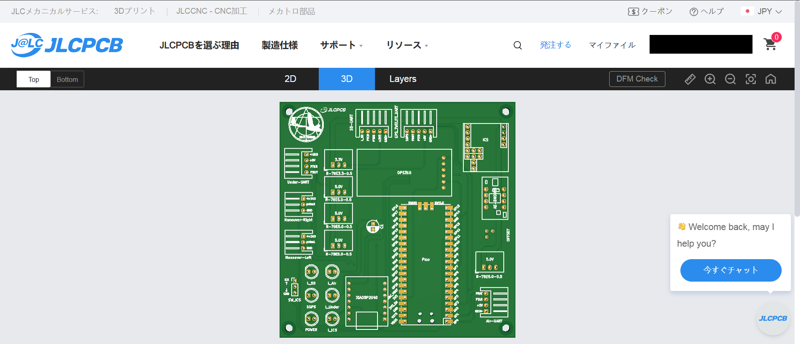

  図10　ガーバーデータの確認

 

アップロードできたら，オプションの設定を行います．基本的に数量の設定以外はデフォルト設定のままで大丈夫です．デフォルト設定を図11～13に載せておきます．

  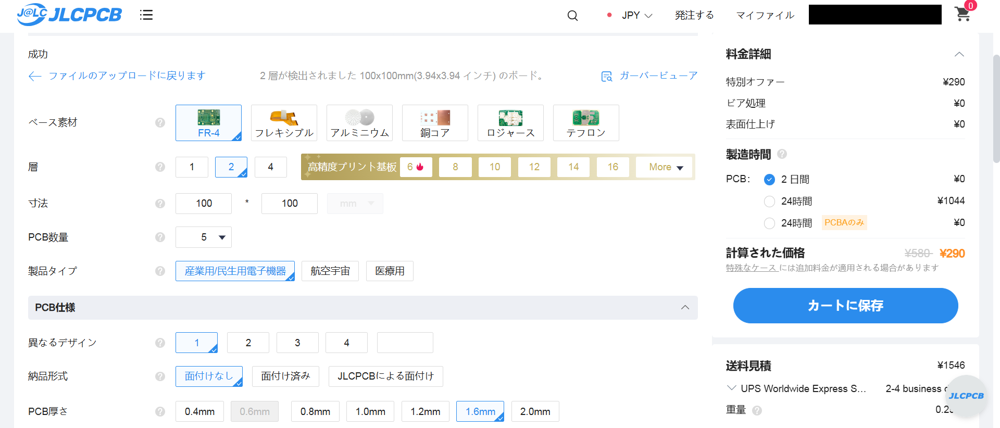

  図11　発注オプションの設定（１）

  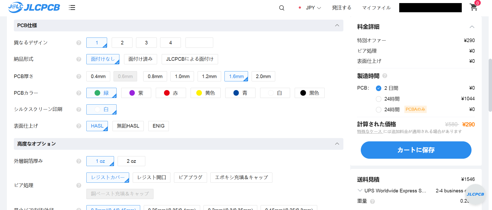

  図12　発注オプションの設定（１）

  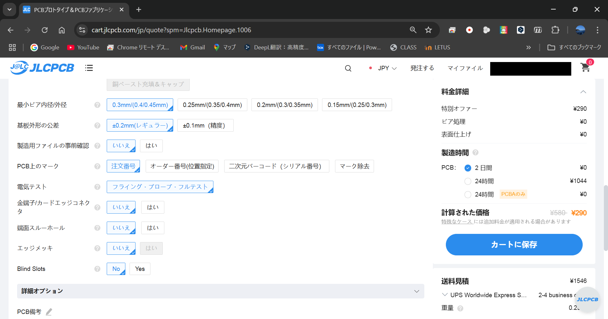

  図13　発注オプションの設定（１）

 

次に配送方法を選択します（図14）．お好きな方法でどうぞ．またクーポンの選択もここで行いましょう．

  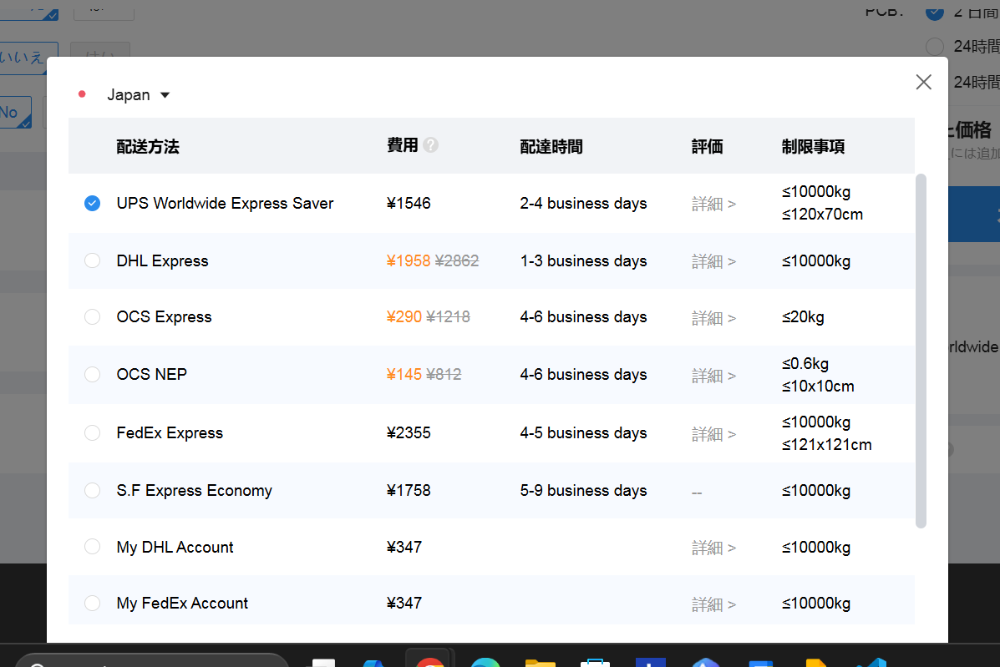

  図14　配送方法の選択

 

配送会社を選択出来たら，「カートに保存」をクリックします．そしてカートボタンを押し，注文を確認します（図15）．

  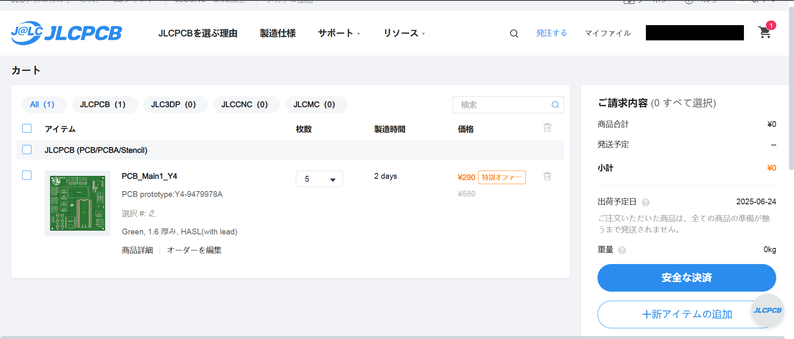

  図15　注文の確認

 

確認できたら画面右側の「安全な決済」をクリックし，支払方法や配送先を入力し，決済を完了させて下さい．これで発注完了です．

