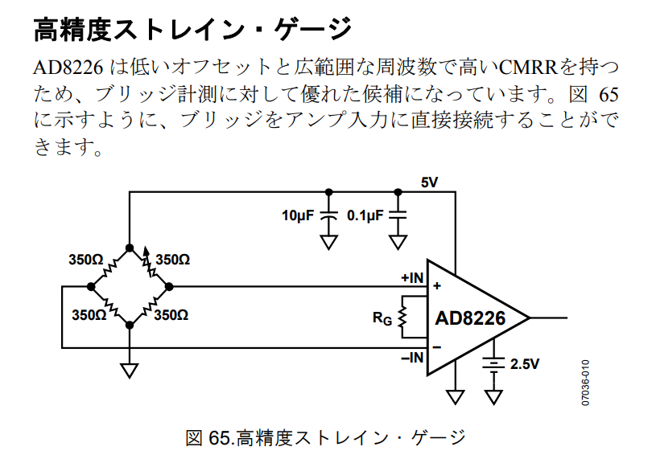

# ロードセルとアンプ
ロードセルから出力される差電圧は最大でも10mV程度であるため，増幅するためのアンプや，高分解能なADCが必要になる．

## ロードセルの出力とは
||
|:--:|
|ロードセル内部の配線図|

ロードセル内部にはホイートストンブリッジが組まれている．  
図の+EXCに電源，-EXCにGND（ADC用GNDだと精度が上がる）を接続する．
ここでは，電源に5Vが印加されているとする．  

||
|:--:|
|ロードセルの仕組み|

4つの抵抗のうち1つがひずみゲージ（荷重や圧力によって抵抗値が大きくなる）である．  
無負荷では，図の4つの抵抗値はだいたい一緒なので+SIGと-SIGの電位は等しく，およそ2.5V程度になるはずである．  
力が加わり，ひずみゲージの抵抗値が変化すると，+SIGと-SIGの間で電位差が生まれる．  
この差がロードセルの出力である．

この差電圧がどれほどかを見積もるには，ロードセルの定格出力（大抵1~2mV/V）を見れば良い．  
これが意味するのは，最大負荷時における電源電圧1V当たりのロードセルの出力差電圧である．  
例えば，定格容量2kg，定格出力1mV/Vのロードセルに5Vを入力すると，最大負荷時（2kgf）の出力差電圧は5mV/Vとなる．

マイコンでこの微小な差電圧を正確に測定するのは不可能なので，増幅しなければならない．  
以降は，これを増幅するアンプについて述べる．  

## HX711を用いる方法
秋月で[IC単体](https://akizukidenshi.com/catalog/g/g112473/)，[モジュール](https://akizukidenshi.com/catalog/g/g112370)いずれも購入できる．

- ICを動かすために必要な周辺の実装部品が少し多い．
- 最大でサンプリングレートが80Hzまで，すなわち最大0.0125秒の遅れが発生する恐れがある．
  - 26代では，危険回避時に入力の遅れは許されないと考えて不足と判断した．
  - 10m/sのとき125mm進んでしまう．
  - しかしながら，人間の反応速度は最短0.1秒であり，十分だったかもしれない．
- IC自体の耐久性が不明，低めに見積もることができた．
  - 24bitという超高精度なAD変換をおこなう特殊なICである．
  - 電源とGNDの逆接続で破損させた経験があった．
- デジタル信号を解析する必要があり，マイコンの処理が複雑化する．

## オペアンプを用いる方法
オペアンプ1つと抵抗4つで差動増幅回路を組むことで，ロードセルからの出力を増幅することができる．  
<https://qiita.com/shuji4649/items/dcb1c5e77eaaa294974e#方法2：オペアンプの差動増幅回路で増幅させて読む>

増幅された電圧を直接マイコンのADCで読みとれるため，マイコンの処理がシンプルになる．

||
|:--:|
|オペアンプによる差動増幅回路|

この回路では，

$$ 1 \times 10^{6} / 330 \approx 3030　\text{ 倍} $$

の増幅がなされる．

問題は，汎用オペアンプでは
- 非常に高い増幅率に比べてコモンモードノイズの除去が不十分になること（CMRRが低い）．
- 抵抗の誤差が取得できる値に大きく影響すること（増幅率が変わる）．

## 計装アンプを用いる方法
オペアンプ単体だと発生する問題を解決してくれる．
- 高いCMRR．
- 1つのゲイン抵抗（$ R_G $）を用いて増幅率（ゲイン）を設定できる．

秋月で[AD8226ARZ](https://akizukidenshi.com/catalog/g/g117564/)が購入できる．

|||
|:--:|:--:|
|ピン配置|ロードセルの接続例|

データシートにはご丁寧にロードセルの配線例がある．  
0.1μFと10μFのバイパスコンデンサは必須，どちらも適当なセラミックコンデンサで構わない．  
$ -V_{S} $および$ V_{REF} $に関してはGNDに直結で問題ないと見ている．  
26代での検証の結果，  
$ +V_{S} = 3.3\text{ V} $，  
$ V_{REF} = -V_{S} = 0\text{ V} $のとき，
最大の出力電圧は$ V_{OUT} = \text{約}1.8\text{ V} $であった．
内部のオペアンプ回路構成の制限で，これ以上には増幅されなかった．  
$ +V_{S} $を5Vにすればこの制限を排除できるが，一時的に3.3Vを超える電圧がかかる恐れがある（マイコンに3.3Vを超える電圧を入力すると壊れる可能性がある）．  

26代では保護回路を組むのが面倒だったので，ゲインを落とすことにした．  
$ R_G = 100\ \Omega $ として，3.3mVの入力でがおよそ1.6Vの出力になるように（495倍）増幅した．  
3.3Vの入力範囲をフルに使いたかったが，これでも十分な解像度があったため妥協した．

ゲインは以下の式で定まる．

$$ G = 1 + \frac{49.4\text{ k}\Omega}{R_G} $$

ゲインが変わると困るので，ゲイン抵抗には精度の高い金属皮膜抵抗を使用した．
26代では少々過剰だったかもしれないが，秋月の[超精密級 金属皮膜チップ抵抗器 2012 1/8W100Ω ±0.1%](https://akizukidenshi.com/catalog/g/g111795/)を使用した．