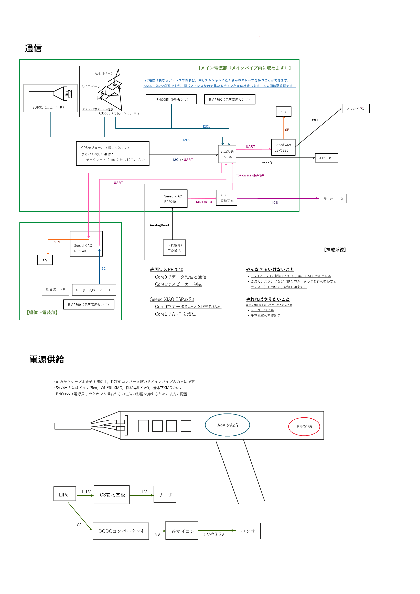
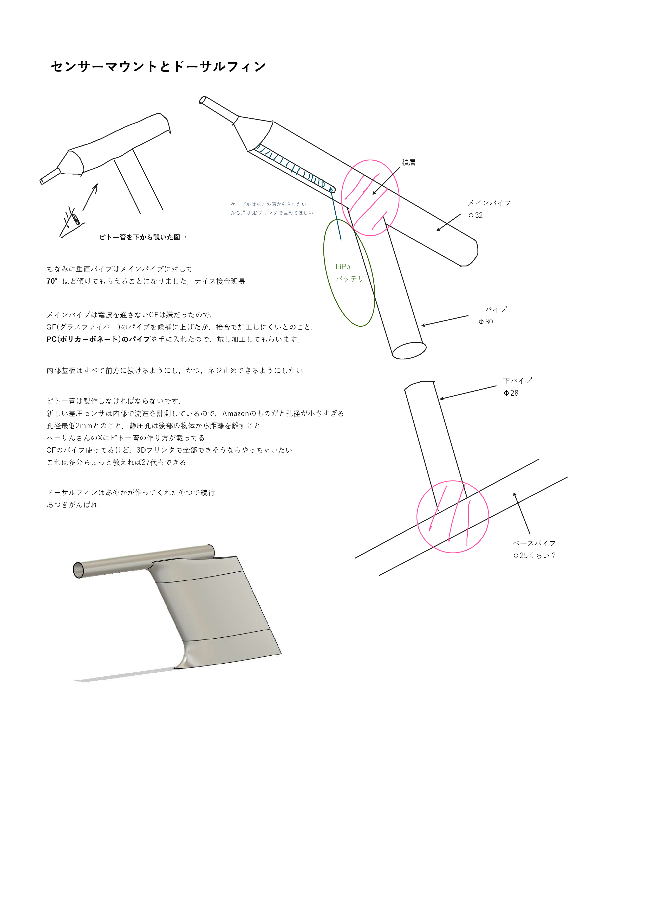

# 4-Design（設計）

仕様書を参考にシステム全体の構造を決定する．

システムがどう動くのかわかるように設計図を作り，
図では伝わらない仕様を書き加え，設計書としてまとめる．

設計図の作成は，PowerPointや[draw.io](https://www.drawio.com)を用いて個人で行うか，
[Googleスライド](https://docs.google.com/presentation/)の強力な共有機能を用いて複数人で行うことを勧める．

 

## （例）23代-全体像

## （例）25代-全体像

## （例）26代-設計書

 

> [鳥科23代電装班長のブログ](https://771-8bit.com/blog/birdman-glider-avionics/)や
[鳥科25代電装班長の引き継ぎ資料](https://geode-kicker-e37.notion.site/25-2f6f665803ce8097996fc91f3fffd729)
を参考にさせていただきました．誠にありがとうございました．

 

